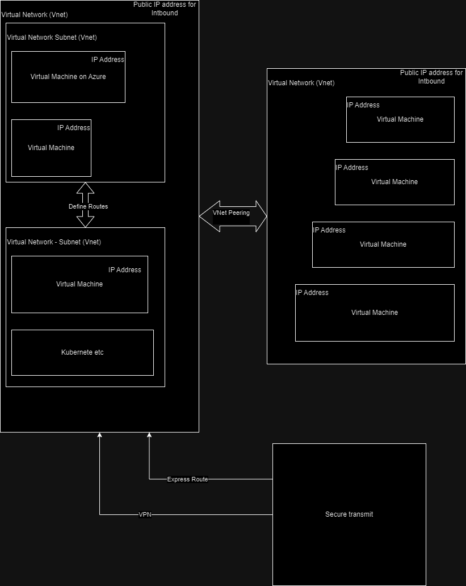

# Azure Administrator 
## Study Guild
- Skill measured

    |No|Skill|Weight|Detail|
    |:-:|:-|:-|:-|
    |1|Manage Azure identities and goverenance|20-25%|[link](https://learn.microsoft.com/en-us/credentials/certifications/resources/study-guides/az-104#manage-azure-identities-and-governance-2025)|
    |2|Implement and manage storage|15-20%|[link](https://learn.microsoft.com/en-us/credentials/certifications/resources/study-guides/az-104#implement-and-manage-storage-1520)|
    |3|Deploy and manage Azure compute resources|20-25%|[link](https://learn.microsoft.com/en-us/credentials/certifications/resources/study-guides/az-104#deploy-and-manage-azure-compute-resources-2025)|
    |4|Implement and manage virtual networking|15-20%|[link](https://learn.microsoft.com/en-us/credentials/certifications/resources/study-guides/az-104#implement-and-manage-virtual-networking-1520)|
    |5| Monitor and maintain Azure resources|10-15%|[link](https://learn.microsoft.com/en-us/credentials/certifications/resources/study-guides/az-104#monitor-and-maintain-azure-resources-1015)|

# Table of Content
# Table of Acronym
|No|Name|Meaning|
|:-:|:-|:-|
|1|SAAS|Software as a Service - Ex: Slack or Office 365 on Browser|

# Overview
- Azure ru from Microsoft servers around the word
- 3 core element: compute, storage and networking
## Overview Azure Services
### Compute
- Virtual Machine - Infrastructure as a Service
- App Service - Platform as a Service
- Now use Azure Container Instane - ACI
    - Multiplle container - use Azure Kubernetes Service
- Azure function (less recommended) - Include individual functions
### Storage
- Blob storage: colection of files, Its have a flat stucture not hiarachy, typically use for raw data like videos, images.
    - Have multiplle access tier:

        |Type|Archive|Cool|Hot|
        |:-|:-|:-|:-|
        |Purposse|Rearly access files such as backup files|Files that expected to access once a month|Frequently access files|
        |Cost|Lowest|Medium|Highest|
        |Time for retrieval cost|Highest - several hours||
- Azure File Storage: Like SMB server or file share that can mount on Window servers
- Azure Data Lake Gen 2: for data analystic application
- SQL server database: most common use
- Azure Synapse Analystics: best choice for datawarehouse
- Azure Cosmos DB: application that abstract large amount of users. It's amazing database for large scale. However, it's not support all the features of relation database
- Azure Cache for Redis 
### Virtual Network (Vnet)

## Sevice Catagories
- Azure provide services more than compute, storage, networking
### Azure migrate
- 
### Azure DevOps
#### Azure Pipelines
#### Azure DevTest Labs
#### Azure Content Delivery Network
### Azure IOT 
#### Central 
#### Hub
#### Sphere
### Analytics services of Azure
#### Azure Databricks
#### Azure spark
### Azure Machine Learning
### Intergration tools
- Azure Logic Apps

### How to manage services in solutions
- Azure Monitor
    - Tracking Azure resources
- Azure Backup 
    - Azure VM need to build Backup service
- Azure Advisor
    - Predict how to utilize systemm
- Security Center
    - Dashboard that contain security information
- Azure Policy
    -   If system need to comply with rule, use this
- Threat Protection
- Arm Template
- Azure Blueprints

# Identity and Acess Management (IAM) in Azure using Entra ID
- What is Entra ID - Azure Active Directory
    - Entra ID is cloud-based identity and manage access services which allow your employees connect to external sources such as SAAS

    - Microsoft Entra ID provide ``benefit to members`` of your organization based on ``their roled``

    |Roled|Benefit|
    |:-|:-|
    |IT Admins|- Control access to apps and app resources based on requirements   - Automate user provisioning   - Provided powerful tools to protect identities and credentials|
    |App developers|- Using Entra ID as a standard-based authentication provider that helps them add single signed on (SSO) to apps that work with existing user credential   - Can use Entra API to build personalized experiance using organizational data|
    |Subscribers|- Such as Microsoft 365,.. -> Already use Entra ID|