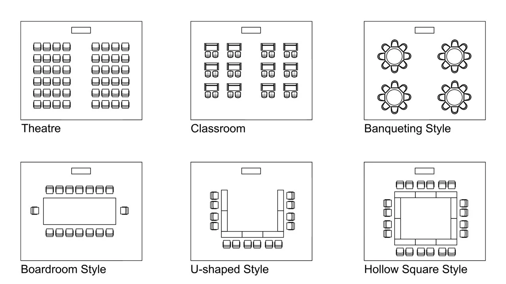

# Table of content
1. [Introduction](#Introduction)
2. [Planning](#Planning)
3. [Presentation](#Presentation)
    1. [OvercomeNerf](#OvercomeNerf)
    2. [DuringThePresentation](#DuringThePresentation)
# Introduction
## Preparation
## Practical skills
- How to do a great start
- Keeping main body
- How to finish
# Planning
## TheOneCentralMessage 
- Had to be clear
- One way to have clear central message is drawing a mind map or a list
- Decide order to talk in mind map
- Do the main body first then the introduction
    - Main body should be 3 to 5 sections (more will make audiences overload)
- Timing
    - Think about minute per slide that you usually present (think about order factors such as interact with audiences)
    - Ideally 3 to 5 minutes per slide
    - Sum of for the time presentation then consider about cut off slide
## Preparing a good start
- Start with a question
- Start with a mysterious start
    - Start with an story, an idea or even a problem but don't give the solution immediately
- What is in it for me
    - Reason what benefit audiences the most
## Practicalities to Cover (Intro)
- Start with audience is the most important then who I am
    - Prepare with question what benefit for audience
- Intro about the length of the talk
- Put of agenda (visual agenda all the time or 2 section then show agenda)
- Best is statement in the intro interrupted for question (for interaction and not make audience bored with some understanding)
- Finish Intro with a question (indicate intro is over and go to section 1)
## Finish
- Don't finish with any question and apology
- Way to finish
    - "So there you have it" factor
    - Summary or recap
    - Call for an action (putting some trigger in there mind to remember)
        - Ex: Sele - Next time you buy, please consider us
    - Have a quiz (One more chance to tell main point)
## Know your audience
- Type
    - Culture
    - Age
    - Competence
    - Target
- Size
- What sort of visual aid
    - Flipchart
    - PP
    - Handout (with gaps)
- Never have visual aid
# Presentation
## OvercomeNerf
### Self Talk
- Lie to your self until it's true
- Don't make yourself nerf by think bad
### Backup plan for everything
- Bring your own laptop, projector, handout, pens, wire just in case
    - Nothing can't stop me
### Step out the stage
- Talk to audience 
    - find out they are just normal people
    - may adjust the talk cause find out who they are
### The early bird
- Get there early and check the room and equipments
    -   Knowing the environment
- Go though every single slide if using other computer 
### It is better you stand up
- Audience see you
- Respect Audience
- More in control and more confidence
### Ask audiences question during the talk
- Prepare a question for in the present
    - make sure audience with you -> feal great and motivate
    - Pick up or hand up if audience is all introvert ^.^
### Practice makes perfect
- Have a run through to check the time before do the talk
## DuringThePresentation
### Looking the part (what to where)
- Chose the clothe similar to audience but little bit smarter
- Nothing distracting
- Professional and boring (boring mean similar to audience)
### How to plan the room
- Pay attention to room layout (U layout, Classroom, Caffe, Straight)
    - Choose right strategy to keep audience attention

- Where to stand so not to block the screen
- Don't block the door
    - Audience don't feel trap
    - Not get distracted while present 
### Give them a sign
- Emphasize the  progress of the present
    - Make the audience where they are in the road
- Sign an end
    - "not throw a bom in Nagasaki" ^.^
### Body Language
- Relaxed and be yourself
    -   Not do anything weird with your hand
- Walk around a little bit
- Spread a eye contact equally
### Audience interact
- Allow time for interaction
- Correct if audience is struggling
    - Have time to think
- Write on the flip chart
- Plan your question
### Do a talk without a notes
- Never read from a script
- Never learn a script by heart
- A page of note but hiding from the audience
- Avoid cue cart
- Cued by your visual aid
- Put on slide if there some number cannot remember
- Only bullet
### Good and Bad Microsleep
- There are two type of microsleep (distracted)
    - Microsleep is when your eyes open but your brain will not process information       
    - Distracted because boring
- Avoid:
    - One way is say something twice
    - Visual by image
    - Sum of so audience can get back on the train
### Talks longer than 15' must have activities
- Discussion in pair
- Shout things out
- Post it wall
- Student presentation
- Worked example
- Quiz
### Three general style presentation
- Use example (or stories) for abstract ideal
    - example then main ideal or ideal than example
- Humor and avoid rehearse (for the sake of God don't prepare it)
- Think what can go wrong in the talk
### Essential Powerpoint tips
- In sw laptop - fucking check it
- Spell check - spelling mistake will make all your point meaningless ^.^
- Keep text minimal
- Not too many slide
- Basic design (yellow or green will make it hard to see)
- Have a clicker
- Build the slide (appearing the word not use the sound)
- Include some photo
- Include some diagram but not big diagram (if you have too many list think about converting to diagram)
### Dealing with any problem 
- Tricky question: Ask audience or admit don't know the question
- Emergency: tea break
### Should and When give out note
- Before the talk
- Note with gap
- A finish note after talk (not let them know we will do that)
- Note act as a cue
### Ending Perfectly on Time
- Have a disposal buffer (put in the end so can get rid of it)
- Remember to sign post the end